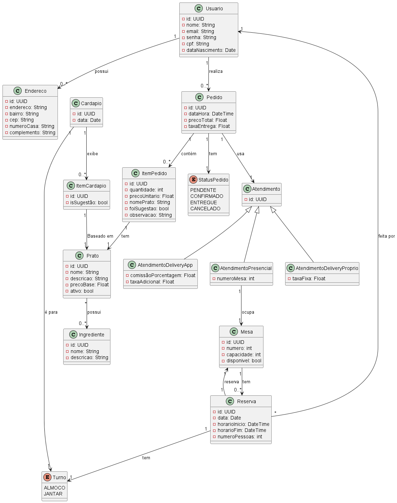

# Tópicos 3 - a1 

Trabalho desenvolvido para a matéria de Tópicos em Programação 3 do curso de Sistemas de Informação da UNITINS.
Trabalho desenvolvido por:
- [Alisson de Oliveira Lima](https://github.com/alissonlima086)
- [Ana Paula Gomes Miranda](https://github.com/anapaula020)

# Docker Setup

Este projeto roda localmente usando Docker e Docker Compose, com SQL Server (Express ou Azure SQL Edge).

## Pré-requisitos

- [Docker](https://www.docker.com/get-started) instalado e rodando
- [Docker Compose](https://docs.docker.com/compose/) disponível

## Como rodar

1. Abra o Docker e espere ele iniciar.
2. No terminal, na raiz do projeto, execute:

```bash
docker compose up --build
```

> Observação: devido a diferença de formatos entre o windows e o linux, pode haver um erro para o docker executar o shell script do Entrypoint, caso ocorra, execute o seguinte comando dentro da raiz do projeto e rode novamente:
```bash
(Get-Content entrypoint.sh -Raw) -replace "`r`n", "`n" | Set-Content entrypoint.sh -NoNewline
```

3. Aguarde alguns instantes até que:

- O SQL Server esteja pronto  
- As migrations sejam aplicadas  
- O aplicativo seja iniciado  

> Observação: na primeira vez que rodar, isso pode demorar um pouco mais, o container precisa baixar a imagem, restaurar pacotes e criar o banco de dados.

4. Acesse a aplicação no navegador:

```
localhost:5000
```

## Parar a aplicação

- Para parar os containers em execução:

```bash
docker compose down
```

- Para parar os containers em execução e limpar o cache:

```bash
docker compose down -v
```


# Estrutura do projeto

Para dar inicio ao desenvolvimento, foi desenvolvido um diagrama de classes UML para nos auxiliar na compreensão do problema.

<p align="center">
  
</p>

Eventualmente o código foi alterado conforme os requisitos do sistema iam ficando mais claros, mas a base principal continuou a do modelo inicial.

## Stack

O projeto foi desenvolvido com .NET 8 para a criação de um projeto MVC, conectando-se ao SQL Server.
Utilizamos as Razor Views para o frontend do painel de administração.
Utilizamos o Blazor Server para o frontend da interface principal do usuário.

| Ferramenta | Função |
|---|---|
| [.NET 8](https://dotnet.microsoft.com/) | Plataforma principal para desenvolvimento da aplicação |
| [ASP.NET Core](https://learn.microsoft.com/aspnet/core) | Framework para construção da aplicação web e APIs |
| [Blazor Server](https://learn.microsoft.com/aspnet/core/blazor) | Framework para construção da interface interativa no servidor |
| [Entity Framework Core](https://learn.microsoft.com/ef/core) | ORM para acesso e manipulação do banco de dados |
| [SQL Server](https://www.microsoft.com/sql-server) | Sistema de gerenciamento de banco de dados relacional |
| [ASP.NET Core Identity](https://learn.microsoft.com/aspnet/core/security/authentication/identity) | Sistema de autenticação e gerenciamento de usuários |
